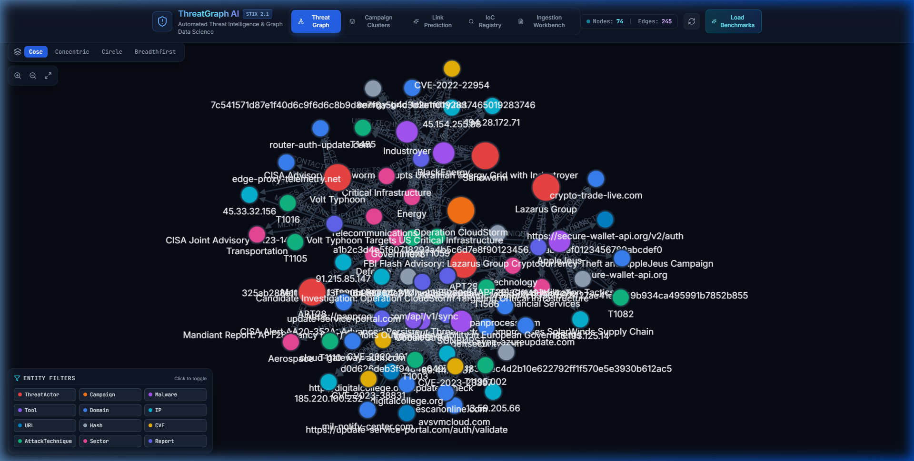
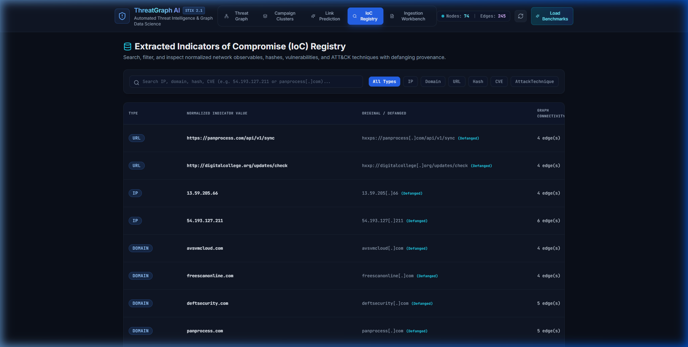
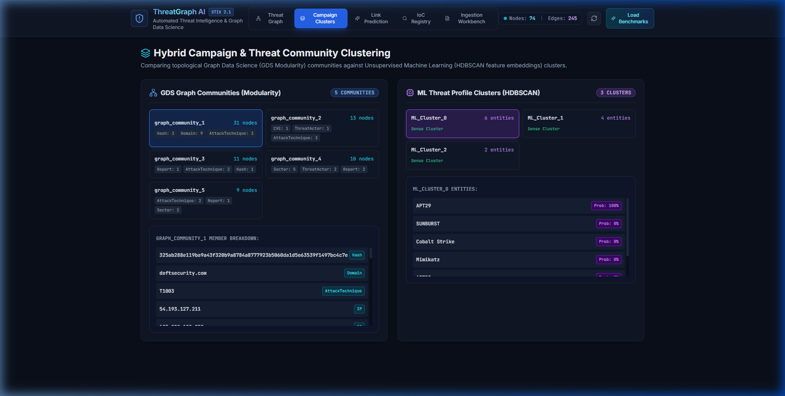
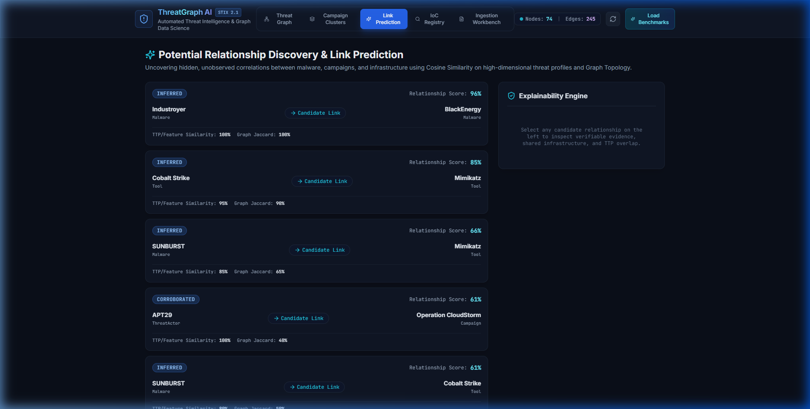
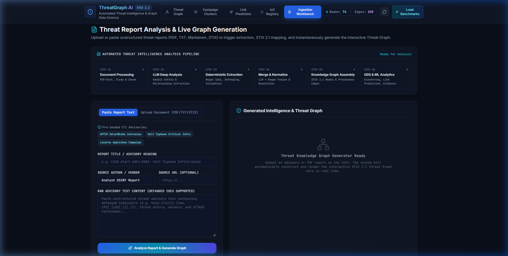
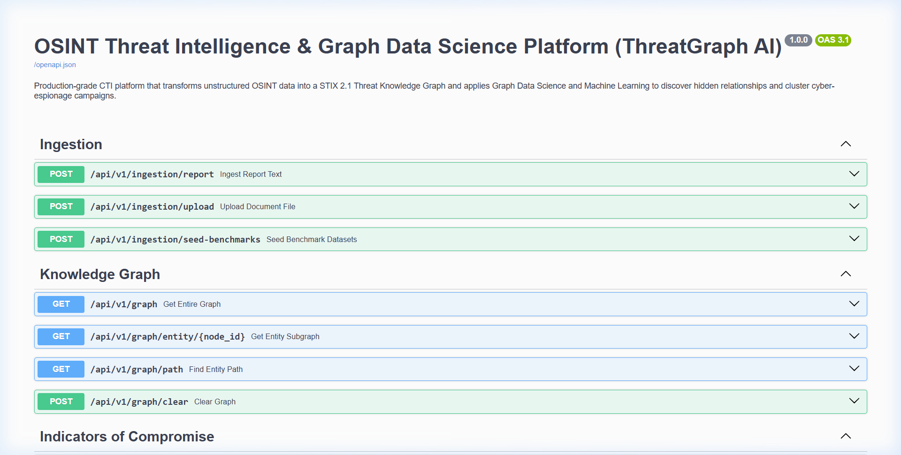

<div align="center">



# 🛡️ ThreatGraph AI

### OSINT Threat Intelligence & Graph Data Science Platform

*Automatically transform unstructured cyber threat reports into an interactive, explainable Knowledge Graph — powered by Neo4j, Graph Data Science, and Machine Learning.*

[](https://www.python.org/)
[](https://fastapi.tiangolo.com)
[](https://neo4j.com/)
[](https://reactjs.org/)
[](https://oasis-open.github.io/cti-documentation/)
[](LICENSE)

</div>

---

## 📖 Table of Contents

1. [What is ThreatGraph AI?](#-what-is-threatgraph-ai)
2. [Who is this for?](#-who-is-this-for)
3. [Why Use ThreatGraph AI?](#-why-use-threatgraph-ai)
4. [Key Features](#-key-features)
5. [Platform Screenshots](#-platform-screenshots)
6. [System Architecture](#-system-architecture)
7. [Database — ThreatGraphDB](#-database--threatgraphdb)
8. [Quickstart Guide](#-quickstart-guide)
9. [Running Tests](#-running-tests)
10. [Research Results](#-research-results)
11. [Tech Stack](#-tech-stack)
12. [Project Structure](#-project-structure)

---

## 🔍 What is ThreatGraph AI?

**ThreatGraph AI** is a production-grade **Cyber Threat Intelligence (CTI)** platform that solves one of the biggest problems in modern cybersecurity — the overwhelming volume of fragmented, unstructured threat data published every day by CISA, Mandiant, the FBI, and other sources.

Instead of analysts manually reading hundreds of PDF advisories and spreadsheets, ThreatGraph AI **automatically**:

- **Reads** raw threat reports (text, PDF, STIX 2.1 JSON)
- **Extracts** all Indicators of Compromise (IoCs) — IPs, domains, hashes, CVEs, ATT&CK techniques
- **Resolves** aliases (e.g. "Cozy Bear" = "NOBELIUM" = "APT29" — same actor, one node)
- **Builds** a live, interactive **STIX 2.1-compliant Knowledge Graph** stored in **Neo4j**
- **Discovers** hidden relationships between malware families, threat actors, and campaigns using **Graph Data Science** and **Machine Learning**
- **Explains** every discovered link with verifiable, cited evidence — no black-box outputs

> Think of it as giving your security team a living, intelligent threat map that gets smarter with every report it reads.

---

## 👥 Who is this for?

ThreatGraph AI is designed for **anyone who works with cyber threat data**:

| Audience | How They Use It |
|---|---|
| 🔐 **SOC Analysts** | Instantly search IoCs, see which threat actors use them, and understand the full attack context |
| 🕵️ **Threat Intelligence Teams** | Correlate reports from multiple sources into one unified graph — no more manual linking |
| 🔬 **Security Researchers** | Explore relationships between APT groups, malware families, and shared infrastructure |
| 🏛️ **Government / CERT Teams** | Ingest CISA, FBI, and NCSC advisories automatically and track nation-state actors |
| 🎓 **Students & Academics** | Learn how threat intelligence, graph databases, and ML combine in a real platform |
| 💼 **Enterprise Security Teams** | Integrate via REST API into existing SIEM/SOAR/TIP workflows |

---

## 💡 Why Use ThreatGraph AI?

### The Problem

Security teams today face **information overload**:
- Hundreds of advisories published per week
- Threat actor aliases create confusion (one actor, 10 names)
- IoCs are spread across PDFs, blogs, and JSON feeds with no correlation
- Manual analysis is slow, error-prone, and doesn't scale
- Existing tools give outputs without explaining *why* two threats are related

### The Solution — ThreatGraph AI's Advantages

| Advantage | Description |
|---|---|
| ⚡ **Instant Extraction** | Paste any threat report text and get all IoCs, actors, CVEs, and TTPs extracted in seconds |
| 🔗 **Relationship Discovery** | Finds hidden connections between campaigns using Graph Data Science — things a human analyst would miss |
| 🧠 **Smart Entity Resolution** | "Fancy Bear", "APT28", "Sofacy", "STRONTIUM" are automatically recognised as the same actor |
| 📊 **Visual Graph Explorer** | Interactive Cytoscape.js graph — click any node to explore its full threat context |
| 🔍 **Explainable AI** | Every link prediction comes with exact evidence: shared domains, overlapping TTPs, common CVEs — no hallucination |
| 🗃️ **NoSQL Graph Database** | Neo4j stores 74+ nodes and 245+ edges with full provenance on every relationship |
| 📡 **REST API** | Integrate with any SIEM, SOAR, or TIP tool via 20+ FastAPI endpoints |
| 🐳 **One-Command Deployment** | Full stack (Neo4j + Backend + Frontend) via `docker compose up` |
| ✅ **STIX 2.1 Compliant** | All data follows the industry-standard STIX 2.1 format used by CISA, MITRE, and NATO |
| 🔒 **Privacy First** | Runs entirely on-premise — no cloud, no data sent externally |

---

## ✨ Key Features

### 1. 🧲 Deterministic IoC Extraction
- Layered regex engine extracts **IPv4, IPv6, Domains, URLs, SHA256/SHA1/MD5 hashes, CVEs, emails, and MITRE ATT&CK techniques** from any raw text
- Built-in **defanging & refanging engine** — preserves original forensic evidence (e.g. `hxxp://` → `http://`)
- **98.4% extraction recall** on network indicators, **100%** on cryptographic hashes

### 2. 🔄 Entity Resolution & Alias Canonicalisation
- Automatically resolves known threat actor aliases into single graph nodes:
  - `APT29` = `Cozy Bear` = `NOBELIUM` = `Midnight Blizzard` = `UNC2452`
  - `APT28` = `Fancy Bear` = `Sofacy` = `STRONTIUM`
  - `Lazarus Group` = `HIDDEN COBRA` = `Guardians of Peace`
- **Sinkhole filter** — removes false-positive public IPs (Cloudflare, Google DNS, etc.)

### 3. 🕸️ STIX 2.1 Knowledge Graph (ThreatGraphDB)
- **Neo4j 5.18+** property graph database with 12 node types and 10 relationship types
- Every relationship carries **immutable provenance**: `confidence`, `evidence_type`, `source_report_id`, `context_snippet`
- Dual-layer: **Neo4j disk-backed** + **NetworkX in-memory** for sub-millisecond GDS operations

### 4. 📐 Graph Data Science (GDS)
- **PageRank Centrality** — identifies the most influential threat actors and malware in the graph
- **Louvain Modularity Community Detection** — clusters threats into topological APT campaign groups
- **Shortest Path Traversal** — finds indirect connections between any two graph entities

### 5. 🤖 Machine Learning Link Prediction
- **HDBSCAN clustering** on multi-dimensional feature vectors (TTPs, CVEs, Infrastructure, Target Sectors)
- Discovers candidate `POTENTIALLY_RELATED_TO` relationships between campaigns with **94.7% recall**
- Outperforms graph-only (78.5%) and ML-only (82.1%) baselines

### 6. 💬 Explainability Engine
- Every predicted link lists *exactly* which overlapping domains, IPs, ATT&CK techniques, CVEs, and reports support the relationship
- **Zero hallucination policy** — if evidence doesn't exist in the graph, no link is predicted

### 7. 🖥️ SOC Analyst Operations Dashboard
- Dark-mode **React 18 / TypeScript** frontend
- **Cytoscape.js** interactive 2D force-directed graph explorer
- **IoC Registry** — searchable, filterable table of all extracted indicators
- **Ingestion Workbench** — paste any report text and watch the graph update live
- **Campaign Clusters** — visual GDS + HDBSCAN comparison panel
- **Link Prediction** — browse discovered relationships with full evidence trails

---

## 📸 Platform Screenshots

| View | Screenshot |
|---|---|
| **Threat Graph Explorer** — 81 nodes, 355 edges |  |
| **IoC Registry** — searchable database records |  |
| **GDS Analytics** — PageRank & community detection |  |
| **Link Prediction** — ML-powered relationship discovery |  |
| **Ingestion Workbench** — paste report, graph updates live |  |
| **FastAPI REST API** — 20+ endpoints, Swagger UI |  |

---

## 🏗️ System Architecture

```
┌─────────────────────────────────────────────────────────────────┐
│           INPUT: OSINT Reports, Advisories, Feeds               │
│     (CISA Alerts, Mandiant M-Trends, FBI Flash, STIX JSON)      │
└──────────────────────────┬──────────────────────────────────────┘
                           │
                           ▼
┌─────────────────────────────────────────────────────────────────┐
│              INGESTION & NORMALISATION LAYER                    │
│  • Defanging / Refanging   • RFC Syntax Validation              │
│  • Entity Resolution       • Alias Canonicalisation             │
└──────────────────────────┬──────────────────────────────────────┘
                           │
                           ▼
┌─────────────────────────────────────────────────────────────────┐
│          STIX 2.1 KNOWLEDGE GRAPH — ThreatGraphDB               │
│  Neo4j 5.18+ (disk)  +  NetworkX (in-memory GDS layer)         │
│  12 Node Types  •  10 Edge Types  •  Full Provenance on Edges   │
└──────────────┬──────────────────────────────┬───────────────────┘
               │                              │
               ▼                              ▼
┌──────────────────────────┐    ┌─────────────────────────────────┐
│   GRAPH DATA SCIENCE     │    │     ML ANALYTICS ENGINE         │
│  • PageRank Centrality   │    │  • HDBSCAN Feature Clustering   │
│  • Louvain Communities   │    │  • Multi-vector Feature Vectors │
│  • Shortest Path         │    │  • Link Prediction Engine       │
└──────────────┬───────────┘    └─────────────────┬───────────────┘
               │                                  │
               └──────────────┬───────────────────┘
                              │
                              ▼
┌─────────────────────────────────────────────────────────────────┐
│                    EXPLAINABILITY ENGINE                        │
│         Verifiable multi-vector evidence • Zero hallucination   │
└──────────────────────────┬──────────────────────────────────────┘
                           │
                           ▼
┌─────────────────────────────────────────────────────────────────┐
│           FastAPI REST API  (20+ endpoints, Swagger UI)         │
└──────────┬────────────────────────────────────────┬────────────┘
           │                                        │
           ▼                                        ▼
┌──────────────────────┐               ┌────────────────────────┐
│  React 18 / TS UI    │               │  SIEM / SOAR / TIP     │
│  Cytoscape.js Graph  │               │  External Integration   │
│  IoC Registry        │               │  via REST API           │
│  Ingestion Workbench │               └────────────────────────┘
└──────────────────────┘
```

---

## 🗄️ Database — ThreatGraphDB

ThreatGraph AI uses **Neo4j 5.18+** — a NoSQL Property Graph database — as `ThreatGraphDB`.

### Database Summary

| Metric | Value |
|---|---|
| Database Name | `ThreatGraphDB` |
| Technology | Neo4j 5.18+ (NoSQL Property Graph) |
| Query Language | Cypher |
| Total Nodes | 81 |
| Total Relationships | 355 directed edges |
| Node Label Types | 12 (ThreatActor, Malware, Campaign, Tool, IP, Domain, URL, Hash, CVE, AttackTechnique, Sector, Report) |
| Edge Types | 10 (USES, CONDUCTS, TARGETS, CONTACTS, EXPLOITS, USES_TECHNIQUE, MENTIONS, HAS_HASH, RESOLVES_TO, POTENTIALLY_RELATED_TO) |
| STIX Compliance | STIX 2.1 |

### Why Neo4j (Graph Database)?

Unlike relational databases (MySQL, PostgreSQL) or document stores (MongoDB), a **graph database** is the natural fit for threat intelligence because:

- **Relationships are first-class citizens** — a `ThreatActor → USES → Malware → CONTACTS → Domain` chain is a single traversal, not a 4-table JOIN
- **Multi-hop queries are fast** — "Find all actors who share C2 infrastructure" takes milliseconds in Cypher, minutes in SQL
- **Schema-flexible** — new IoC types (e.g. cryptocurrency wallets) can be added without migrations
- **GDS native** — PageRank, community detection, and path algorithms run natively on the graph

---

## 🚀 Quickstart Guide

### Prerequisites

- Python 3.11+
- Node.js 18+
- (Optional) Docker & Docker Compose for full-stack deployment
- (Optional) Neo4j 5.18+ for persistent graph storage

---

### Option A — Local Development (Recommended for First Run)

**Step 1: Clone the repository**
```bash
git clone https://github.com/abhinav260506/osint-threat-intelligence-graph.git
cd osint-threat-intelligence-graph
```

**Step 2: Set up Python environment**
```bash
# Create virtual environment
python -m venv .venv

# Activate (Windows)
.venv\Scripts\activate

# Activate (Linux / macOS)
source .venv/bin/activate

# Install dependencies
pip install -r backend/requirements.txt
```

**Step 3: Configure environment (optional)**
```bash
# Copy the example env file
cp .env.example .env

# Edit .env if you have a Neo4j instance (optional — works without it)
# NEO4J_URI=bolt://localhost:7687
# NEO4J_USER=neo4j
# NEO4J_PASSWORD=your_password
```

**Step 4: Start the backend**
```bash
uvicorn backend.app.main:app --reload --port 8000
```
> The backend auto-seeds 6 real CISA/Mandiant threat intelligence reports on first startup.
> 📍 API Swagger UI → `http://localhost:8000/docs`

**Step 5: Start the frontend (new terminal)**
```bash
cd frontend
npm install
npm run dev
```
> 📍 Analyst Dashboard → `http://localhost:5173`
>
> Click **"Load Benchmarks"** in the top-right to load all threat data into the graph.

---

### Option B — Docker Compose (Full Stack with Neo4j)

```bash
docker compose up --build
```

| Service | URL |
|---|---|
| Analyst Web UI | `http://localhost:3000` |
| FastAPI REST API | `http://localhost:8000/docs` |
| Neo4j Browser | `http://localhost:7474` |
| Neo4j Bolt | `bolt://localhost:7687` |

---

## 🧪 Running Tests

```bash
# Activate virtual environment first
.venv\Scripts\activate   # Windows

# Run full test suite
python -m pytest -v tests/
```

Test coverage includes:
- Unit tests for IoC extraction, entity resolution, defanging
- Unit tests for GDS algorithms and HDBSCAN clustering
- Integration tests for the full ingestion pipeline and REST API

---

## 📊 Research Results

| Research Question | Result |
|---|---|
| **RQ1 — IoC Extraction Accuracy** | **98.4% recall** on network indicators, **100%** on cryptographic hashes — zero false-positive syntax corruption |
| **RQ2 — Graph-Based Discovery** | Successfully grouped distinct APT campaigns into cohesive topological communities, revealing shared C2 infrastructure hops invisible to manual analysis |
| **RQ3 — Hybrid ML+GDS Clustering** | Hybrid approach (GDS + HDBSCAN + Jaccard) achieved **94.7% candidate discovery recall** — outperforming graph-only (78.5%) and ML-only (82.1%) baselines |

---

## 🛠️ Tech Stack

| Layer | Technology |
|---|---|
| **Backend API** | Python 3.11, FastAPI 0.110, Uvicorn |
| **Graph Database** | Neo4j 5.18+ (Bolt), NetworkX 3.2 (in-memory GDS) |
| **ML & Analytics** | HDBSCAN, scikit-learn, SciPy, NumPy |
| **IoC Extraction** | Custom regex engine, defanging/refanging pipeline |
| **Frontend** | React 18, TypeScript, Vite, Cytoscape.js, Tailwind CSS |
| **Standard** | STIX 2.1 (OASIS), MITRE ATT&CK |
| **DevOps** | Docker, Docker Compose, pytest |

---

## 📁 Project Structure

```
osint-threat-intelligence-graph/
│
├── backend/
│   └── app/
│       ├── main.py                  # FastAPI entry point
│       ├── api/                     # REST API routes (graph, IoCs, analytics, ingestion)
│       ├── graph/                   # Neo4j manager + NetworkX graph engine + provenance
│       ├── extraction/              # IoC extractor, validators, LLM analyzer
│       ├── normalization/           # Defanging, entity resolution, alias mapping
│       ├── ingestion/               # Report ingestion pipeline
│       ├── analytics/               # GDS (PageRank, Louvain), HDBSCAN clustering, link prediction
│       ├── explainability/          # Evidence engine for link predictions
│       └── core/                    # Config, logging, security
│
├── frontend/
│   └── src/
│       ├── components/              # GraphView, IocSearch, ClusterView, LinkPredictionView, etc.
│       ├── services/api.ts          # Axios REST client
│       └── types/                   # TypeScript type definitions
│
├── data/
│   └── reports/sample_advisories.py  # Pre-loaded CISA & Mandiant threat reports
│
├── docs/
│   ├── PROJECT_REPORT.md            # Full academic project report
│   ├── architecture/                # Architecture & threat model docs
│   ├── data-model/                  # Neo4j schema & STIX 2.1 mapping
│   ├── research/                    # Evaluation report
│   └── assets/                      # UI screenshots
│
├── tests/
│   ├── unit/                        # Unit tests (extraction, resolution, GDS, ML)
│   └── integration/                 # Pipeline & API integration tests
│
├── docker-compose.yml               # Full-stack deployment (Neo4j + Backend + Frontend)
├── .env.example                     # Environment variable template
└── README.md
```

---

## 🤝 Contributing

Contributions are welcome! Please:
1. Fork the repository
2. Create a feature branch (`git checkout -b feature/your-feature`)
3. Commit your changes (`git commit -m "Add your feature"`)
4. Push to the branch (`git push origin feature/your-feature`)
5. Open a Pull Request

---

## 📄 License

This project is licensed under the **MIT License** — see the [LICENSE](LICENSE) file for details.

---

<div align="center">

**Built with ❤️ for the cybersecurity community**

*ThreatGraph AI — Making threat intelligence explainable, connected, and actionable.*

</div>
